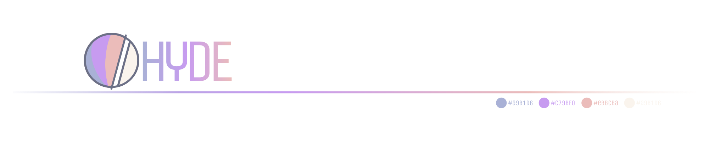
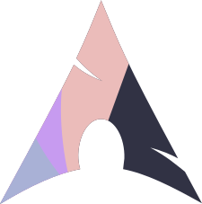
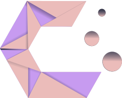
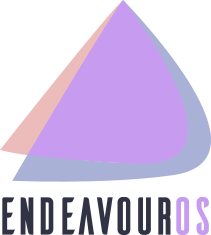
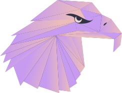
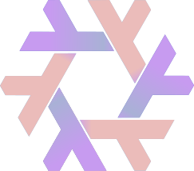

<div align = center>

<a href="https://discord.gg/AYbJ9MJez7">
    
  </a>
</div>

###### _<div align="right"><a id=-design-by-t2></a><sub>// diseño por t2</sub></div>_



<!--
Soporte para README multilingüe.
-->

<!-- ALL-CONTRIBUTORS-BADGE:START - Do not remove or modify this section -->
[](#contributors-)
<!-- ALL-CONTRIBUTORS-BADGE:END -->
[](../../README.md)
[](README.de.md)
[](README.nl.md)
[](README.zh.md)
[](README.fr.md)
[](README.ar.md)
[](README.pt-br.md)
[](README.tr.md)

<div align="center">

<br>

<a href="#instalación"><kbd> <br> Instalación <br> </kbd></a>&ensp;&ensp;
<a href="#actualizar"><kbd> <br> Actualizar <br> </kbd></a>&ensp;&ensp;
<a href="#contribuir"><kbd> <br> Contribuir <br> </kbd></a>&ensp;&ensp;
<a href="#temas"><kbd> <br> Temas <br> </kbd></a>&ensp;&ensp;
<a href="#estilos"><kbd> <br> Estilos <br> </kbd></a>&ensp;&ensp;
<a href="../assets/keybinds/KEYBINDINGS.es.md"><kbd> <br> Atajos <br> </kbd></a>&ensp;&ensp;
<a href="https://www.youtube.com/watch?v=2rWqdKU1vu8&list=PLt8rU_ebLsc5yEHUVsAQTqokIBMtx3RFY&index=1"><kbd> <br> Youtube <br> </kbd></a>&ensp;&ensp;
<a href="https://hydeproject.pages.dev/"><kbd> <br> Wiki <br> </kbd></a>&ensp;&ensp;
<a href="https://discord.gg/qWehcFJxPa"><kbd> <br> Discord <br> </kbd></a>

</div><br><br>

<div align="center">
  <div style="display: flex; flex-wrap: nowrap; justify-content: center;">
    
    
    
    
    
  </div>
</div>

Mire esto para ver la nota completa:
[Viaje a HyDE y más allá](./Hyprdots-to-HyDE.es.md)

<!--


-->

<https://github.com/prasanthrangan/hyprdots/assets/106020512/7f8fadc8-e293-4482-a851-e9c6464f5265>

<br>

<a id="instalación"></a>


---

El script de instalación está diseñado para una instalación mínima de [Arch Linux](https://wiki.archlinux.org/title/Arch_Linux), pero **puede** llegar a funcionar en algunas [Distros basadas en Arch](https://wiki.archlinux.org/title/Arch-based_distributions).
Aunque instalar HyDE junto con otros [DE](https://wiki.archlinux.org/title/Desktop_environment)/[WM](https://wiki.archlinux.org/title/Window_manager) debería funcionar, debido a que es una configuración muy personalizada, **entrará en conflicto** con su tematización de [GTK](https://wiki.archlinux.org/title/GTK)/[Qt](https://wiki.archlinux.org/title/Qt), [Shell](https://wiki.archlinux.org/title/Command-line_shell), [SDDM](https://wiki.archlinux.org/title/SDDM), [GRUB](https://wiki.archlinux.org/title/GRUB), etc., y lo hace bajo su propio riesgo.

Para soporte en NixOS hay un proyecto separado que se mantiene en [Hydenix](https://github.com/richen604/hydenix/tree/main)

> [!IMPORTANT]
> El script de instalación detectará automáticamente una tarjeta NVIDIA e instalará los controladores **nvidia-open-dkms** para su kernel.
> Para tarjetas antiguas, [revise esto primero](https://chatgpt.com/Scripts/nvidia-db/)
> Asegúrese de que su tarjeta NVIDIA sea compatible con los controladores dkms en la lista proporcionada [aquí](https://wiki.archlinux.org/title/NVIDIA).

> [!CAUTION]
> El script modifica su configuración de `grub` o `systemd-boot` para habilitar **NVIDIA DRM**.

Para instalar, ejecute los siguientes comandos:

```shell
sudo pacman -S --needed git base-devel
git clone --depth 1 https://github.com/HyDE-Project/HyDE ~/HyDE
cd ~/HyDE/Scripts
./install.sh
```

> [!TIP]
> También puede añadir cualquier otra aplicación que desee instalar junto con HyDE en `Scripts/pkg_user.lst` y pasar el archivo como parámetro para instalarlo de la siguiente manera:
>
> ```shell
> ./install.sh pkg_user.lst
> ```

> [!IMPORTANT]
> Consulte su lista en `Scripts/pkg_extra.lst`
> o puede ejecutar `cp Scripts/pkg_extra.lst Scripts/pkg_user.lst` si desea instalar todos los paquetes adicionales.

<!--
Como segunda opción de instalación, también puede utilizar `Hyde-install`, lo cual podría resultar más sencillo para algunos.
Consulte las instrucciones de instalación de HyDE en [Hyde-cli - Usage](https://github.com/kRHYME7/Hyde-cli?tab=readme-ov-file#usage).
-->

Por favor, reinicie el sistema una vez que el script de instalación haya finalizado y lo lleve por primera vez a la pantalla de inicio de sesión de SDDM (o a una pantalla negra).
Para más detalles, consulte la [wiki de instalación](https://github.com/HyDE-Project/HyDE/wiki/installation).

<div align="right">
  <br>
  <a href="#-design-by-t2"><kbd> <br> 🡅 <br> </kbd></a>
</div>

<a id="actualizar"></a>


---

Para actualizar HyDE, deberá obtener los últimos cambios desde GitHub y restaurar las configuraciones ejecutando los siguientes comandos:

```shell
cd ~/HyDE/Scripts
git pull origin master
./install.sh -r
```

> [!IMPORTANT]
> Tenga en cuenta que cualquier configuración que haya realizado se sobrescribirá si está incluida en la lista de `Scripts/restore_cfg.psv`.
> Sin embargo, todas las configuraciones reemplazadas se respaldan y pueden recuperarse desde `~/.config/cfg_backups.`

<!--
Como segunda opción de actualización, puede utilizar `Hyde restore ...``, que ofrece una mejor manera de gestionar las opciones de restauración y respaldo.
Para más detalles, consulte la [wiki de gestión de dots de Hyde-cli](https://github.com/kRHYME7/Hyde-cli/wiki/Dots-Management)
-->

<div align="right">
  <br>
  <a href="#-design-by-t2"><kbd> <br> 🡅 <br> </kbd></a>
</div>

<a id="contribuir"></a>


---

¡Damos la bienvenida a las contribuciones de la comunidad! Para comenzar:

- Consulte nuestras pautas en [CONTRIBUTING.md](CONTRIBUTING.md)
- Lea sobre los roles del equipo en [TEAM_ROLES.md](TEAM_ROLES.md)
- Revise nuestro proceso de lanzamiento en [RELEASE_POLICY.md](RELEASE_POLICY.md)
- Agregue su nombre en [CONTRIBUTORS.md](CONTRIBUTORS.md) al realizar su primer PR

Ya sea que ayude con código, pruebas o documentación, agradecemos su apoyo para mejorar HyDE para todos. ¡Gracias!

<div align="right">
  <br>
  <a href="#-design-by-t2"><kbd> <br> 🡅 <br> </kbd></a>
</div>

<a id="ravnvm"></a>


---

RavnVM permite ejecutar ramas y commits de RaVN en una máquina virtual aislada para pruebas y desarrollo.

## Inicio rápido

### Arch Linux

```bash
# Descargar y ejecutar (detectará automáticamente los paquetes faltantes)
curl -L https://raw.githubusercontent.com/robert-flo/Valhalla/master/Scripts/ravnvm/ravnvm.sh -o ravnvm
chmod +x ravnvm
./ravnvm
```

### NixOS (o Nix)

```bash
# Usando el flake de Valhalla
nix run github:robert-flo/Valhalla

# O si tiene el repositorio clonado localmente
nix run .
```

Para más detalles, consulte el [README de RavnVM](Scripts/ravnvm/README.md).

<div align="right">
  <br>
  <a href="#-design-by-t2"><kbd> <br> 🡅 <br> </kbd></a>
</div>

<a id="temas"></a>


---

Todos nuestros temas oficiales se almacenan en un repositorio separado, lo que permite a los usuarios instalarlos usando themepatcher.
Para más información, visite [HyDE-Project/hyde-themes](https://github.com/HyDE-Project/hyde-themes).

<div align="center">
  <table><tr><td>

[](https://github.com/HyDE-Project/hyde-themes/tree/Catppuccin-Latte)
[](https://github.com/HyDE-Project/hyde-themes/tree/Catppuccin-Mocha)
[](https://github.com/HyDE-Project/hyde-themes/tree/Decay-Green)
[](https://github.com/HyDE-Project/hyde-themes/tree/Edge-Runner)
[](https://github.com/HyDE-Project/hyde-themes/tree/Frosted-Glass)
[](https://github.com/HyDE-Project/hyde-themes/tree/Graphite-Mono)
[](https://github.com/HyDE-Project/hyde-themes/tree/Gruvbox-Retro)
[](https://github.com/HyDE-Project/hyde-themes/tree/Material-Sakura)
[](https://github.com/HyDE-Project/hyde-themes/tree/Nordic-Blue)
[](https://github.com/HyDE-Project/hyde-themes/tree/Rose-Pine)
[](https://github.com/HyDE-Project/hyde-themes/tree/Synth-Wave)
[](https://github.com/HyDE-Project/hyde-themes/tree/Tokyo-Night)

  </td></tr></table>
</div>

> [!TIP]
> Cualquiera, incluyendo usted, puede crear, mantener y compartir temas adicionales, todos los cuales se pueden instalar usando themepatcher.
> Para crear su propio tema personalizado, consulte la [wiki de tematización](https://github.com/prasanthrangan/hyprdots/wiki/Theming).
> Si desea que su tema de HyDE se muestre o quiere encontrar algunos temas no oficiales, visite [kRHYME7/hyde-gallery](https://github.com/kRHYME7/hyde-gallery).

<div align="right">
  <br>
  <a href="#-design-by-t2"><kbd> <br> 🡅 <br> </kbd></a>
</div>

<a id="estilos"></a>


---

<div align="center"><table><tr>Selección de Tema</tr><tr><td>
</td><td>
</td></tr></table></div>

<div align="center"><table><tr><td>Selección de Fondo de Pantalla</td><td>Selección del Lanzador</td></tr><tr><td>
</td><td>
</td></tr>
<tr><td>Modos de Wallbash</td><td>Acción de Notificación</td></tr><tr><td>
</td><td>
</td></tr>
</table></div>

<div align="center"><table><tr>Lanzador Rofi</tr><tr><td>
</td><td>
</td><td>
</td></tr><tr><td>
</td><td>
</td><td>
</td></tr><tr><td>
</td><td>
</td><td>
</td></tr><tr><td>
</td><td>
</td><td>
</td></tr>
</table></div>

<div align="center"><table><tr>Menú de WLogout</tr><tr><td>
</td><td>
</td></tr></table></div>

<div align="center"><table><tr>Lanzador de Juegos</tr><tr><td>
</td><td>
</td><td>
</td></tr></table></div>
<div align="center"><table><tr><td>
</td><td>
</td></tr></table></div>


<a id="star_history"></a>

                        
[](https://starchart.cc/HyDE-Project/HyDE)


---

<a id="creditos"></a>


- [Consulte todos los Créditos aquí](./CREDITS.md).

---

<div align="right">
  <br>
  <a href="#-design-by-t2"><kbd> <br> 🡅 <br> </kbd></a>
</div>

<div align="right">
  <sub>Última edición el: 01/01/2026<span id="last-edited"></span></sub>
</div>

<a id="contributors-"></a>
## Contribuidores ✨

Muchas gracias a estas maravillosas personas  ([clave de emojis](https://allcontributors.org/docs/en/emoji-key)):

<!-- ALL-CONTRIBUTORS-LIST:START - Do not remove or modify this section -->
<!-- prettier-ignore-start -->
<!-- markdownlint-disable -->
<table>
  <tbody>
    <tr>
      <td align="center" valign="top" width="14.28%"><a href="https://rubiin.is-a.dev"><br /><sub><b>Rubin Bhandari</b></sub></a><br /><a href="https://github.com/HyDE-Project/HyDE/commits?author=rubiin" title="Code">💻</a></td>
      <td align="center" valign="top" width="14.28%"><a href="https://github.com/kRHYME7"><br /><sub><b>Khing</b></sub></a><br /><a href="https://github.com/HyDE-Project/HyDE/commits?author=kRHYME7" title="Code">💻</a> <a href="https://github.com/HyDE-Project/HyDE/commits?author=kRHYME7" title="Documentation">📖</a></td>
    </tr>
  </tbody>
</table>

<!-- markdownlint-restore -->
<!-- prettier-ignore-end -->

<!-- ALL-CONTRIBUTORS-LIST:END -->

Este proyecto sigue la especificación de [all-contributors](https://github.com/all-contributors/all-contributors). ¡Se aceptan contribuciones de cualquier tipo!
